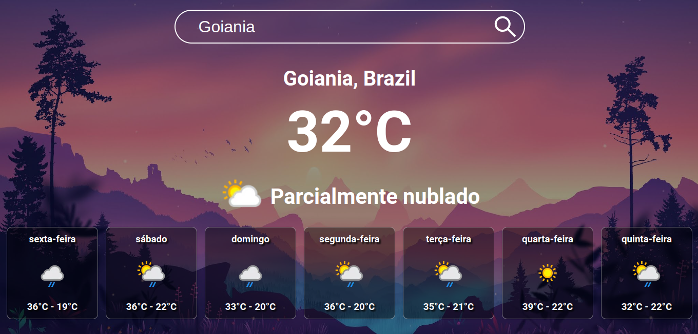

## Tela inicial do App 🌆

## Descrição 🧾

- Projeto feito para prática de HTML, CSS e Javascript.

- Esse projeto utiliza uma API pública chamada [Weather API](https://www.weatherapi.com/)

- No campo de pesquisa você digita o nome de uma cidade ele retornará a temperatura atual daquela cidade e logo abaixo a previsão para os próximos 8 dias

